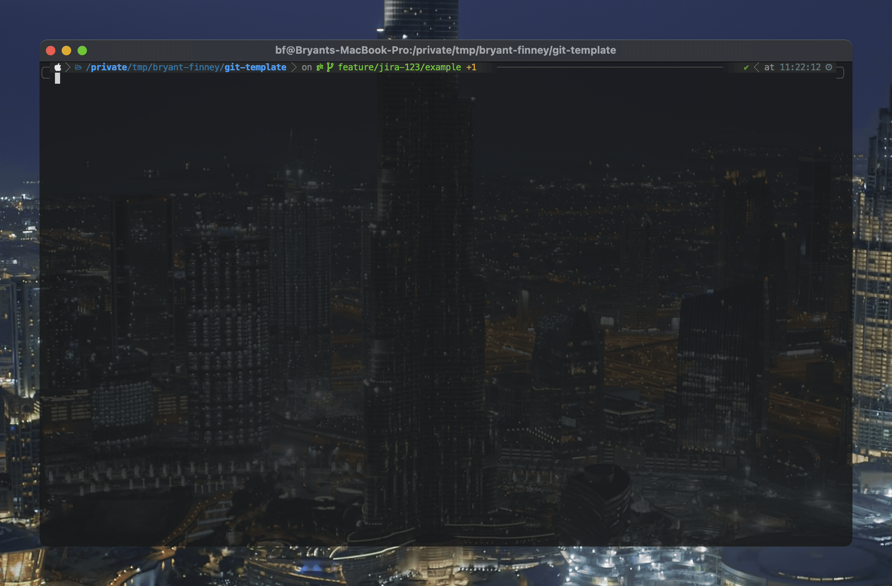

# 

This project sets `git` hooks for each new repository that is created or cloned.

## Usage

After installing the [`gh` CLI](https://cli.github.com/), run the following command:

```sh
# the template directory can be placed anywhere
export template_dir="$HOME/.git_template"

# clone the repo
gh repo clone bryant-finney/git-template "$template_dir"

# update the global git config
git config --global init.templateDir "$template_dir"
```

Now, all future repos will be created with the hooks provided by this repo:

```sh
$ ls -1 "$template_dir/hooks" | grep -v sample
prepare-commit-msg

$ mkdir -p /tmp/test-git-template &&
    cd /tmp/test-git-template &&
    git init
Initialized empty Git repository in /tmp/test-git-template/.git/

$ ls -1 .git/hooks | grep -v sample
prepare-commit-msg
```

### Update Existing Repos

Run the following snippet to add these hooks to the current repo:

```sh
cp ~/.git_template/hooks/* ./.git/hooks/
```

## Hooks

### [`prepare-commit-msg`](hooks/prepare-commit-msg)



Extract commit metadata from the branch name and prepend it to the commit message for conventional
commits. For example, its functionality is shown below:

For example:

```sh
# clone this repo for example purposes:
gh repo clone bryant-finney/git-template /tmp/bryant-finney/git-template &&
    cd /tmp/bryant-finney/git-template &&
    # ... and check out a new feature branch:
    git checkout -b feat/123/new-feature

# create a file to store the commit message (this is normally done by git)
touch example.msg

# run the hook manually on the dummy file:
./hooks/prepare-commit-msg example.msg
cat example.msg
```

The output should look like this:

```
feat(JIRA-123): Removed code.
```

The commit message prefix is extracted as follows (spaces are shown for clarity):

```
f̲e̲a̲t̲ ( J̲I̲R̲A̲-̲1̲2̲3̲ ):      R̲e̲m̲o̲v̲e̲d̲ ̲c̲o̲d̲e̲.̲
  │        │                   │
  │        │                   └───  random commit message
  │        │
  │        │
  │        └─────────────────  from the second part  ─────────────────────┐
  │                                                                       │
  │                                                                       ▼
  ⌎─────  from the first part  ──────────────────────────▶   f̲e̲a̲t̲u̲r̲e̲ / j̲i̲r̲a̲-̲1̲2̲3̲ / example
                                                            └────────────────────────────┘
                                                                               │
                                                                               └── branch name
```

#### GitHub / GitLab Issues

When only numeric characters are present in the second part of the branch name, it is assumed to identify a GitHub / GitLab issue:

```sh
# clone this repo for example purposes:
gh repo clone bryant-finney/git-template /tmp/bryant-finney/git-template &&
    cd /tmp/bryant-finney/git-template &&
    # ... and check out a new feature branch:
    git checkout -b feature/123/example

# create a file to store the commit message (this is normally done by git)
touch example.msg

# run the hook manually on the dummy file:
./hooks/prepare-commit-msg example.msg
cat example.msg
```

The output should look like this:

```
feat(bryant-finney/git-template#123): WIP, always
```

The commit message prefix is extracted as follows (spaces are shown for clarity):

```
f̲e̲a̲t̲ ( b̲r̲y̲a̲n̲t̲-̲f̲i̲n̲n̲e̲y̲ / g̲i̲t̲-̲t̲e̲m̲p̲l̲a̲t̲e̲ #1̲2̲3̲ ):           W̲I̲P̲,̲ ̲a̲l̲w̲a̲y̲s̲
 │           │              │         │                     └─────────  random commit message
 │           │              │         │
 │           │              │         └─  from the second part  ────┐
 │           │              └─  repo name                           │
 │           └─  parent directory                                   │
 │                                                                  ▼
 ⌎─────  from the first part  ──────────────────────────▶   f̲e̲a̲t̲ / 1̲2̲3̲ / new-feature
                                                           └────────────────────────┘
                                                                        │
                                                                        └── branch name
```

Setting the environment variable `GIT_SKIP_OWNER_NAME` omits the `{owner}/{repo}` from the issue
number:

```sh
GIT_SKIP_OWNER_NAME=1 ./hooks/prepare-commit-msg example.msg && cat example.msg
```

```
feat(#123): Last time I said it works? I was kidding.  Try this.
```
